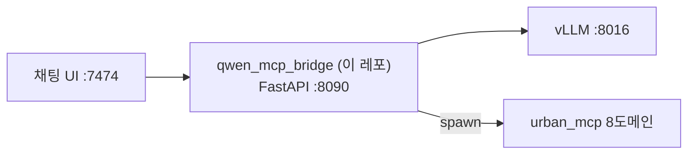
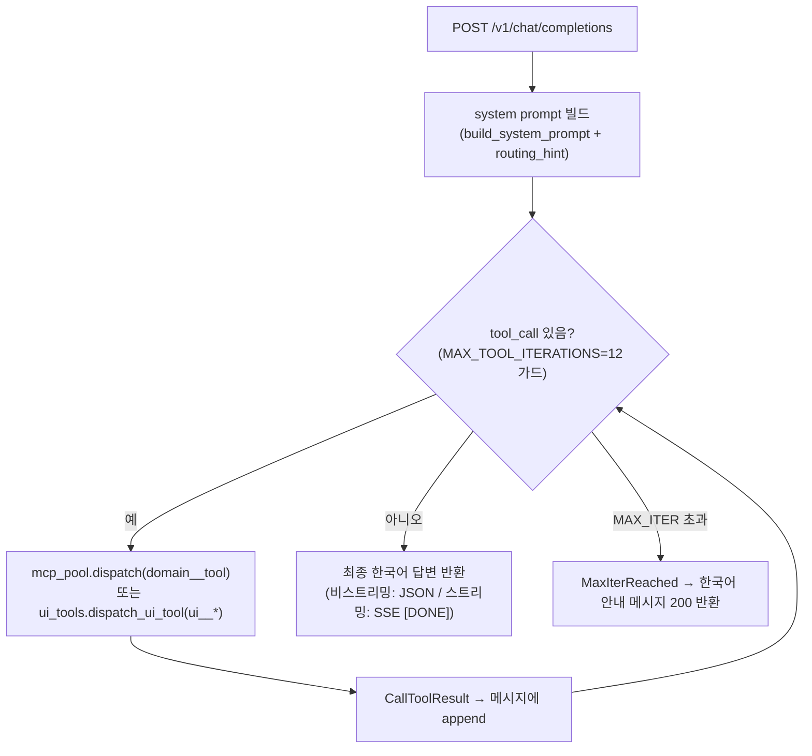

# qwen_mcp_bridge — 아키텍처

> 상위 파이프라인 전체 그림: [../ARCHITECTURE.md](../ARCHITECTURE.md)

---

## 1. 위치 미니맵



vLLM의 Qwen과 urban_mcp 8개 stdio MCP를 잇는 OpenAI 호환 HTTP 브릿지다. 브라우저 채팅 UI(:7474)가 `/api` 프록시를 통해 브릿지(:8090)에 요청을 보내면, 브릿지는 vLLM(:8016)과 urban_mcp stdio 프로세스 사이에서 tool_call 디스패치 루프를 실행하고 최종 한국어 답변을 반환한다. 전체 그림은 [상위 ARCHITECTURE](../ARCHITECTURE.md) 참조.

---

## 2. 모듈 구조

| 파일 | 책임 |
|---|---|
| `server.py` | FastAPI 앱, `/healthz` · `/v1/models` · `/v1/chat/completions` 라우트, lifespan(pool 생성/종료) |
| `mcp_pool.py` | 8도메인 stdio spawn(`uv --directory … run python -m urban_mcp_<domain>`), tool dispatch(`<domain>__<tool>`) |
| `chat_loop.py` | tool_call 디스패치 루프(비스트리밍, `run_chat`) |
| `chat_loop_streaming.py` | SSE 스트리밍 디스패치 루프(`run_chat_streaming`) — delta 청크를 파싱해 content는 클라이언트에 forwarding, tool_calls는 누적 후 dispatch |
| `tool_translation.py` | MCP `Tool` 객체 ↔ OpenAI function 정의 변환, `<domain>__<tool>` prefix 파싱 |
| `prompts.py` | system prompt 빌더 (도메인 8개 가이드, 한국어 전용 규칙 포함) |
| `config.py` | `pydantic-settings` 기반 env 로딩(`Settings`) |
| `ui_tools.py` | in-process UI 도구 6개(`ui__set_basemap`, `ui__toggle_wms_layer`, `ui__set_3d`, `ui__enable_draw`, `ui__fly_to`, `ui__clear_layers`) |
| `query_policy.py` | 라우팅 힌트 생성(`build_routing_hint`) — 필지 컨텍스트를 system prompt에 부가 |
| `visual_filter.py` | SSE 스트리밍 시각화 결과 필터링 (건축가능성 후보, 페이지네이션, 중간 필지 억제) |
| `intent.py` | 질의 의도 분류 보조 |
| `_tool_result.py` | 도구 결과 텍스트 truncate(`truncate_tool_text`) |
| `routing_debug.py` | 라우팅 디버그 유틸리티 |
| `sse_smoke.py` | SSE 스트리밍 연기 테스트 스크립트 |

---

## 3. tool_call 디스패치 루프



**스트리밍 모드** (`stream=true`): `chat_loop_streaming.run_chat_streaming`이 vLLM에 `stream=true`로 호출한다. delta 청크를 파싱해 `delta.content`는 클라이언트에 즉시 forward, `delta.tool_calls`는 누적 후 finish_reason=`tool_calls` 시점에 dispatch한다. 커스텀 SSE 이벤트(`status`, `tool_call`, `ui_action`)를 통해 프론트가 도구 호출 상태와 UI 변경을 실시간으로 수신한다.

---

## 4. 핵심 설계 결정

### 도메인 부분 실패 허용

`McpPool.start()`는 8개 도메인을 개별 try/except로 spawn한다. 일부 도메인 spawn이 실패해도 나머지 도메인은 정상 동작한다. 실패한 도메인은 `_failed_domains`에 기록되며 `/healthz`의 `failed_domains` 필드로 확인 가능하다.

```
GET /healthz
→ {"status": "ok", "ready_domains": ["locate", "inspect", ...], "failed_domains": {}, "tool_count": N, ...}
```

### MAX_TOOL_ITERATIONS 가드

`config.py`의 `max_tool_iterations`(기본값 **12**)가 무한 루프를 방지한다. 초과 시 `MaxIterReached` 예외를 잡아 HTTP 200으로 한국어 안내 메시지를 반환한다.

### in-process UI 도구

`ui__*` 도구는 stdio MCP가 아닌 브릿지 내부에서 즉시 ack를 반환한다. SSE 스트리밍 루프가 `ui_action` 이벤트를 발화하면 프론트가 실제 지도 UI 상태를 변경한다.

### Qwen 인자 타입 강제 변환

Qwen이 정수·실수·배열 인자를 문자열로 보내는 경우가 있다. `mcp_pool._coerce_args()`가 도구의 inputSchema를 참조해 안전하게 타입 변환을 시도한다.

### system 메시지 병합

Qwen3.6 chat template은 system 메시지가 정확히 1개(맨 앞)여야 한다. 클라이언트가 system 메시지를 보낼 경우 브릿지 system content와 병합해 단일 system 메시지로 만든다.

---

## 5. web 프론트 (:7474)

Vite + React 기반 채팅 UI다. `web/` 디렉토리에 위치하며, 개발 서버는 `:7474`에서 동작한다.

**의존성 (주요):**

| 패키지 | 용도 |
|---|---|
| `maplibre-gl` | 2D/3D 지도 렌더링 |
| `@mapbox/mapbox-gl-draw` | 폴리곤/라인/포인트 그리기 도구 |
| `@react-three/fiber`, `three` | 3D 건물 매스 뷰어 |
| `recharts` | 통계 차트 |
| `react-markdown`, `remark-gfm` | AI 답변 마크다운 렌더링 |
| `tailwindcss` | 스타일링 |

**Vite 프록시 (`vite.config.ts`):**

| 경로 | 대상 | 설명 |
|---|---|---|
| `/api/*` | `http://127.0.0.1:8090/*` | 브릿지 API (path rewrite: `/api` prefix 제거) |
| `/wmsapi/*` | `http://175.208.134.144:2521/*` | WMS 타일 서버 |
| `/geoserver/*` | `https://gsvr.dlof.kr/*` | GeoServer WMS |

개발 시 브라우저는 `:7474`에 접속하고, `/api/v1/chat/completions` 등 API 요청이 브릿지 `:8090`으로 투명하게 프록시된다. `timeout: 0`, `proxyTimeout: 0`으로 긴 AI 응답도 타임아웃 없이 수신한다.

**기동:**

```bash
cd web
npm ci
npm run dev    # :7474
```

---

## 6. 함정·제약

### production 정적 서빙 미구현

`README`는 "FastAPI가 `web/dist` 서빙"이라 언급하지만 **`server.py`에 `StaticFiles` mount가 없다**. 현재는 `npm run dev`(:7474) + Vite 프록시로만 동작한다. 프로덕션 배포 시 Nginx 등 별도 정적 서빙 설정이 필요하다.

### VLLM_MODEL 일치 필수

`.env`의 `VLLM_MODEL`은 vLLM 서버가 실제로 서빙 중인 모델 ID와 **정확히 일치**해야 한다. 불일치 시 vLLM이 요청을 거부한다.

```
VLLM_MODEL=Qwen/Qwen3.6-35B-A3B-FP8   # 현재 배포값 — config.py 기본값(sakamakismile/Qwen3.6-35B-A3B-NVFP4)은 placeholder이며 .env가 override
```

### URBAN_MCP_ROOT 경로 정확도

`URBAN_MCP_ROOT`가 실제 urban_mcp 레포 경로와 일치해야 spawn이 성공한다. 경로 오류 시 8개 도메인 전부 `failed_domains`에 등록된다.

```
URBAN_MCP_ROOT=/home/akidor/urban_mcp   # 예시 — 실제 경로로 교체
```

### VITE_VWORLD_API_KEY 미설정 시 basemap 404

`web/.env.local`에 `VITE_VWORLD_API_KEY`가 없으면 기본 VWorld 타일 URL에 빈 키가 삽입되어 basemap 타일이 전부 404로 빈 지도가 표시된다.

```
VITE_VWORLD_API_KEY=여기에_실제_키   # web/.env.local — 비밀값은 직접 입력
```

### urban_mcp uv sync --all-packages 필수

urban_mcp 루트의 `pyproject.toml`은 `dependencies=[]`이므로 `uv sync`만으로는 멤버 패키지가 설치되지 않는다. **반드시 `uv sync --all-packages`를 실행**해야 한다. 미실행 시 브릿지 기동 시점에 spawn이 `ModuleNotFoundError: No module named 'urban_mcp_<domain>'`으로 전부 실패한다.

```bash
cd /path/to/urban_mcp
uv sync --all-packages
```

### SSE 스트리밍과 vLLM reasoning_content

`chat_loop_streaming.py`는 vLLM의 `delta.reasoning_content`를 별도 SSE 이벤트로 전달한다. vLLM 버전에 따라 이 필드가 없을 수 있으므로, 프론트 SSE 핸들러는 해당 이벤트 부재를 정상으로 처리해야 한다.

---

## 7. 외부 의존

| 의존 | 역할 | 비고 |
|---|---|---|
| vLLM `:8016` | Qwen 모델 추론 (OpenAI 호환 API) | 브릿지와 별도 기동 필요 |
| urban_mcp (stdio) | 8도메인 MCP 서버, 57개 도구 | `uv sync --all-packages` 필수 |
| Python `mcp` 라이브러리 | stdio MCP 클라이언트 (`ClientSession`, `StdioServerParameters`) | |
| `pydantic-settings` | env 로딩 | |
| `httpx` | vLLM 비동기 HTTP 클라이언트 | |
| `fastapi`, `uvicorn` | HTTP 서버 | |
| Node.js / npm | web 프론트 빌드·개발 서버 | |
| VWorld 타일 API | 채팅 UI basemap | `VITE_VWORLD_API_KEY` 필요 |
| WMS `175.208.134.144:2521` | 도시계획 WMS 레이어 | |
| GeoServer `gsvr.dlof.kr` | GeoServer WMS | |
